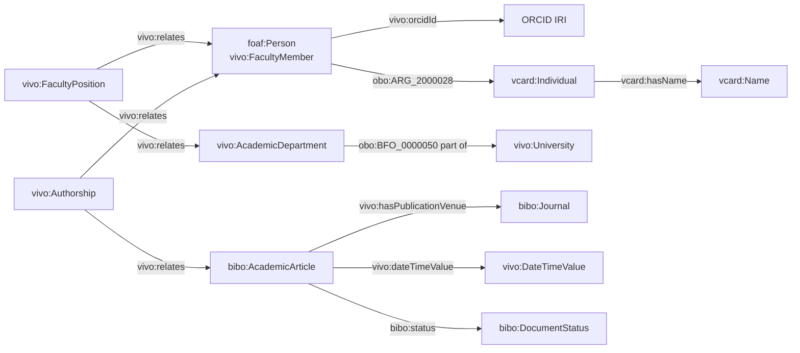

# Research Information Model (VIVO)

An RDF/OWL model for researchers, their organisational affiliation and their scholarly publications, built on the [VIVO Core Ontology](https://github.com/vivo-ontologies/vivo-ontology) (1.9.0-SNAPSHOT), plus SPARQL queries for common reporting questions.

## Contents

- [Repository structure](#repository-structure)
- [Quick start](#quick-start)
- [Namespaces](#namespaces)
- [Model overview](#model-overview)
- [Classes](#classes)
- [Properties](#properties)
- [Modelling decisions](#modelling-decisions)
- [SPARQL queries](#sparql-queries)

## Repository structure

```
.
├── README.md
├── data/
│   └── example.ttl                          # example dataset (Turtle)
└── queries/
    ├── q1_publications_by_orcid.rq
    ├── q2_peer_reviewed_count_journal.rq
    └── q3_publications_per_department.rq
```

## Quick start

1. Load `data/example.ttl` into a triple store (Apache Jena Fuseki, GraphDB, Virtuoso, Blazegraph, ...).
2. Run the queries from `queries/`.
3. Expected results on the example data are listed [below](#sparql-queries).

Example with Apache Jena (`sparql` command line):

```bash
sparql --data data/example.ttl --query queries/q1_publications_by_orcid.rq
```

The file imports the VIVO core ontology (`owl:imports`). For queries that rely on subclass inference, load the VIVO ontology as well. The queries below are written so they do **not** require inference.

## Namespaces

| Prefix | Namespace | Used for |
|---|---|---|
| `vivo` | `http://vivoweb.org/ontology/core#` | Core classes and properties |
| `foaf` | `http://xmlns.com/foaf/0.1/` | Person, Agent |
| `bibo` | `http://purl.org/ontology/bibo/` | Publications, journals, status |
| `vcard` | `http://www.w3.org/2006/vcard/ns#` | Names and contact data |
| `obo` | `http://purl.obolibrary.org/obo/` | BFO/ARG relations (part of, has contact info) |
| `dcterms` | `http://purl.org/dc/terms/` | Optional title |
| `ex` | `http://example.org/ns#` | Local individuals and extensions |

## Model overview



## Classes

| Class | Role in the model | Notes |
|---|---|---|
| `foaf:Person`, `vivo:FacultyMember` | Researcher | Carries a vCard individual for name data |
| `vivo:University` | Institution | Identified by `vivo:rorId` |
| `vivo:AcademicDepartment` | Organisational unit | Part of a university |
| `vivo:FacultyPosition` (sub-class of `vivo:Position`) | Reified affiliation | Relates person and department |
| `bibo:AcademicArticle` | Publication | Restriction: venue must be a `bibo:Journal` |
| `bibo:Journal` | Publication venue | A Periodical (Collection), not a Document |
| `bibo:DocumentStatus` | Publication status | Individuals such as `bibo:peerReviewed` |
| `vivo:Authorship` | Reified authorship | Relates an agent and an information resource |
| `vivo:DateTimeValue` | Publication date | With `vivo:dateTimePrecision` |
| `vcard:Individual`, `vcard:Name`, `vcard:FormattedName` | Person name data | Reached through `obo:ARG_2000028` |

## Properties

| Property | Type | Usage |
|---|---|---|
| `vivo:orcidId` | Object | Person → ORCID IRI, e.g. `<https://orcid.org/0000-0002-1825-0097>` |
| `vivo:confirmedOrcidId` | Object (range `foaf:Person`) | Optional: records that a person confirmed the ORCID iD. Not used for the ORCID value |
| `vivo:rorId` | Datatype | ROR identifier of the organisation |
| `obo:ARG_2000028` | Object | Has contact info (used for names) |
| `obo:BFO_0000050` | Object (transitive) | Part of (department → university) |
| `vivo:relates` | Object | Links reified relationships to their participants |
| `vivo:rank` | Datatype (`xsd:int`) | Author position |
| `vivo:isCorrespondingAuthor` | Datatype (`xsd:boolean`) | Corresponding author flag |
| `vivo:hasPublicationVenue` | Object | Article → journal |
| `vivo:dateTimeValue` | Object | Article → `vivo:DateTimeValue` |
| `vivo:dateTime` | Datatype (`xsd:dateTime`) | Actual date value |
| `vivo:dateTimePrecision` | Object | For example `vivo:yearPrecision` |
| `bibo:doi` | Datatype | Bare DOI without resolver URL |
| `bibo:status` | Object | Document → `bibo:DocumentStatus` |
| `ex:openAccessRoute` | Datatype (local) | Placeholder: VIVO Core has no open-access property |

## Modelling decisions

| Topic | Decision | Reason |
|---|---|---|
| ORCID iD | IRI as object of `vivo:orcidId` | The ontology annotation defines it as an object property with a resource value |
| Names | vCard structure | `foaf:Person` has a restriction requiring contact info of type `vcard:Individual` |
| Affiliation | Reified `vivo:Position` | VIVO pattern; supports dates and rank. `org:memberOf` is not part of VIVO |
| Department hierarchy | `obo:BFO_0000050` | `foaf:Organization` carries a has-part restriction |
| Venue | `bibo:Journal` | `AcademicArticle` restricts venue to `Journal`; a Manuscript is a Document, not a Collection |
| Publication date | `vivo:DateTimeValue` | `vivo:dateTime` requires `xsd:dateTime`; `xsd:gYear` is not allowed |
| DOI | Bare identifier | The resolver URL is not the identifier |
| Open access | `ex:openAccessRoute` | `dcterms:accessRights` expects a rights statement resource, not the literal "Gold" |
| Authorship | `vivo:Authorship` only | `vivo:assignedBy` belongs to Relationships such as Grants, not to publications |

## SPARQL queries

Common patterns:

- `vivo:relates` has no direction, so both participants are type-checked (`foaf:Person`, `bibo:AcademicArticle`) to stop a variable from binding to the wrong participant.
- Positions are matched without `rdf:type`, so queries do not depend on subclass inference (`FacultyPosition` vs `Position`).
- In `SELECT`, aliases after `AS` must be variables (`?name`).

All queries use these prefixes:

```sparql
PREFIX rdfs:  <http://www.w3.org/2000/01/rdf-schema#>
PREFIX foaf:  <http://xmlns.com/foaf/0.1/>
PREFIX vivo:  <http://vivoweb.org/ontology/core#>
PREFIX bibo:  <http://purl.org/ontology/bibo/>
```

### Q1: Publications of a researcher (by ORCID iD)

File: [`queries/q1_publications_by_orcid.rq`](queries/q1_publications_by_orcid.rq)

```sparql
SELECT ?Author (STR(?orcid) AS ?ORCIDID) ?Title ?DOI ?Year ?Status ?Venue
WHERE {
    ?person a foaf:Person ;
            rdfs:label   ?Author ;
            vivo:orcidId ?orcid .
    FILTER (?orcid = <https://orcid.org/0000-0002-1825-0097>)

    ?authorship a vivo:Authorship ;
                vivo:relates ?person ;
                vivo:relates ?publication .
    ?publication a bibo:AcademicArticle ;
                 rdfs:label ?Title ;
                 bibo:doi ?DOI ;
                 bibo:status ?Status ;
                 vivo:hasPublicationVenue ?venue ;
                 vivo:dateTimeValue ?dtv .

    ?dtv vivo:dateTime ?dateTime .
    BIND (YEAR(?dateTime) AS ?Year)

    ?venue a bibo:Journal ;
           rdfs:label ?Venue .
}
```

**Expected result:** one row: Dr. Anna Müller, the ORCID iD, "Open Research Information in Practice", `10.1234/example.2026.001`, 2026, `bibo:peerReviewed`, "Journal of Information Science".

### Q2: Peer-reviewed articles of a researcher in a given journal

File: [`queries/q2_peer_reviewed_count_journal.rq`](queries/q2_peer_reviewed_count_journal.rq)

```sparql
SELECT (COUNT(DISTINCT ?publication) AS ?peerReviewedCount)
WHERE {
    ?person a foaf:Person ;
            vivo:orcidId <https://orcid.org/0000-0002-1825-0097> .

    ?authorship a vivo:Authorship ;
                vivo:relates ?person ;
                vivo:relates ?publication .

    ?publication a bibo:AcademicArticle ;
                 bibo:status bibo:peerReviewed ;
                 vivo:hasPublicationVenue ?venue .

    ?venue a bibo:Journal ;
           rdfs:label "Journal of Information Science" .
}
```

**Expected result:** `1`. Matching a journal by label is fragile; an ISSN (`?venue bibo:issn "..."`) is more robust.

### Q3: Articles per department in a given year

File: [`queries/q3_publications_per_department.rq`](queries/q3_publications_per_department.rq)

```sparql
SELECT ?orgUnit ?orgUnitName (COUNT(DISTINCT ?publication) AS ?publicationCount)
WHERE {
    ?orgUnit a vivo:AcademicDepartment ;
             rdfs:label ?orgUnitName .

    ?position vivo:relates ?orgUnit ;
              vivo:relates ?person .
    ?person a foaf:Person .

    ?authorship a vivo:Authorship ;
                vivo:relates ?person ;
                vivo:relates ?publication .
    ?publication a bibo:AcademicArticle ;
                 vivo:dateTimeValue ?dtv .

    ?dtv vivo:dateTime ?dateTime .
    FILTER (YEAR(?dateTime) = 2026)
}
GROUP BY ?orgUnit ?orgUnitName
```

**Expected result:** one row: Department of Software Development, 1.

### Optional building blocks

Name from vCard:

```sparql
PREFIX vcard: <http://www.w3.org/2006/vcard/ns#>
PREFIX obo:   <http://purl.obolibrary.org/obo/>

?person obo:ARG_2000028 ?vc .
?vc vcard:hasName ?n .
?n vcard:givenName ?given ; vcard:familyName ?family .
BIND (CONCAT(?given, " ", ?family) AS ?Author)
```

Department and university of a person:

```sparql
OPTIONAL {
    ?pos vivo:relates ?person, ?dept .
    ?dept a vivo:AcademicDepartment ; rdfs:label ?Department ;
          obo:BFO_0000050 ?uni .
    ?uni rdfs:label ?University .
}
```
# rdmQuery.exe

`rdmQuery.exe` is a standalone Windows command-line tool, written in Python, that loads RDF data and executes SPARQL queries against it. It lets you run the queries in this repository without installing a triple store or a Python environment.

> **Draft note:** This page was written without access to the tool's source code. Options, output formats and defaults below are assumptions. Check each one against the actual behaviour (`rdmQuery.exe --help`) and correct where needed.

## What it does

- Loads one or more RDF files (Turtle `.ttl`, and other formats the tool supports) into an in-memory graph.
- Loads and executes SPARQL query files (`.rq`) from a file or a folder.
- Displays results as a table in the console and can export them to a file.
- Runs offline. No server, database or internet connection is needed.

## Requirements

- Windows 10 or later (64-bit).
- No Python installation needed. The interpreter and libraries are bundled in the executable.

## Quick start

```bat
:: run the application and it will guide you through the loading ontology and executing the queries
rdmQuery.exe
``` 
## License

Add a license file (for example `LICENSE`) before publishing. The VIVO Core Ontology is released under the [Unlicense](https://spdx.org/licenses/Unlicense.html).
